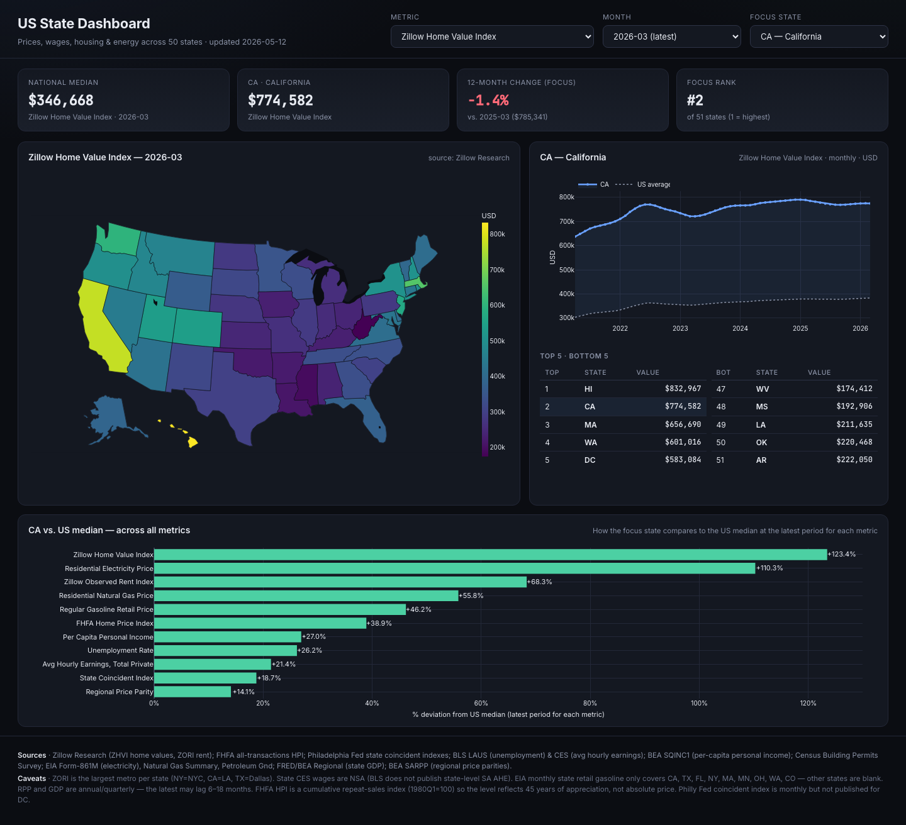

# US State Dashboard

An interactive, single-page dashboard that tracks **13 macro & price indicators across all 50 US states + DC**, monthly (or as frequently as each source publishes). Built as a static site — no backend, no build step, just pre-baked JSON + Plotly.

🔗 **Live demo: <https://jayxu7777.github.io/us-state-dashboard/>**

---

## What you can do

- **Choropleth map** of every metric, with a focus-state highlight, a month/quarter/year selector, and click-to-select on the map.
- **KPI tiles** showing the national median, the focus state's value, 12-month change, and rank (1 = highest of all states with data).
- **Time series** for the focus state with the US average overlaid (dotted line).
- **Top-5 / Bottom-5 ranking table** at the latest period (or a full table when a metric has sparse coverage, e.g. gasoline).
- **Cross-metric deviation chart**: how the focus state compares to the US median on every intensive metric at the latest available period (green = above, red = below).

---

## The 13 metrics

| Group | Metric | Frequency | Coverage | Source |
|---|---|---|---|---|
| **Housing** | Zillow Home Value Index (ZHVI) | Monthly | 51 | Zillow Research |
| | FHFA all-transactions House Price Index (1980 Q1 = 100) | Quarterly | 51 | FHFA via FRED |
| | Zillow Observed Rent Index (largest metro per state) | Monthly | 50 | Zillow Research |
| | Housing units permitted | Monthly | 51 | Census Building Permits Survey |
| **Labor & income** | Average hourly earnings, total private (NSA) | Monthly | 51 | BLS CES |
| | Per-capita personal income (SAAR) | Quarterly | 51 | BEA SQINC1 |
| | Unemployment rate (SA) | Monthly | 51 | BLS LAUS |
| **Energy** | Residential electricity price | Monthly | 51 | EIA Form-861M |
| | Residential natural gas price | Monthly | 51 | EIA Natural Gas Summary |
| | Regular gasoline retail price | Monthly | 9 (CA, TX, FL, NY, MA, MN, OH, WA, CO) | EIA Petroleum-Gnd |
| **Macro** | State nominal GDP (SAAR) | Quarterly | 51 | BEA Regional via FRED |
| | Philly Fed state coincident index (Jul-1992 = 100) | Monthly | 50 (no DC) | Philadelphia Fed via FRED |
| | Regional Price Parity, all items (US = 100) | Annual | 51 | BEA SARPP |

---

## Methodology highlights

- **ZHVI vs FHFA HPI** — kept both intentionally. ZHVI is a Zestimate-based value-weighted level (current $ price proxy); FHFA HPI is a repeat-sales cumulative index from 1980 (tells you how much housing has appreciated). Different stories, different uses.
- **ZORI as largest-metro-per-state** — Zillow only publishes state ZORI partially, so each state uses its largest metro (NY → NYC, CA → Los Angeles, TX → Dallas, …) as proxy. The proxy metro is labelled in the focus-state KPI tile.
- **Wages NSA** — BLS does not publish state-level *seasonally-adjusted* average hourly earnings; the dashboard uses NSA values for that reason.
- **EIA monthly state gasoline** — only 9 states are published monthly. Other states' map cells are intentionally blank.
- **PCPI vs wages** — wages = wage & salary income per hour for employees only; PCPI = wages + supplements + proprietors' income + dividends + interest + rent + transfer receipts, divided by population. DC's PCPI ≈ $117k reflects all those streams, not just hourly pay.
- **Cross-metric deviation chart** — only includes *intensive* metrics (per-unit prices / rates / indices). GDP and permits scale with state size, so their median-deviation would dwarf everything else and are excluded.
- **RPP map uses a diverging colour scale** centred on 100 (US average), so above- and below-cost-of-living states are immediately readable.

---

## Update cadence

Each source publishes on its own schedule:

| Source | Typical lag |
|---|---|
| Zillow ZHVI / ZORI | ~3 weeks after month end |
| BLS LAUS / CES | ~3 weeks |
| Census BPS | ~5 weeks |
| EIA (electricity, natural gas, gasoline) | 1–3 months |
| FRED state series | mirrors the upstream source |
| BEA SQINC1 (quarterly) | ~3 months |
| BEA SARPP (annual RPP) | 12–18 months |

Data files are committed JSON snapshots; the dashboard reads them at page load.

---

## Tech stack

- Plain HTML + CSS + vanilla JS
- [Plotly.js](https://plotly.com/javascript/) (CDN) for the choropleth, time series, and bar chart
- Inter + JetBrains Mono via Google Fonts
- Hosted on GitHub Pages

No build step, no framework, no bundler. The only runtime dependency is the Plotly CDN.

---

## Caveats

- All series shown are nominal (not inflation-adjusted) unless noted.
- RPP and FHFA HPI are *indices*, not dollar values — the level only has meaning relative to the index base period.
- The dashboard is a personal project intended for browsing and high-level comparison. For any decision-making, cite the original source.

---

## Credits

Sources are listed in the dashboard footer and in the table above. Built with [Claude Code](https://claude.com/claude-code).
